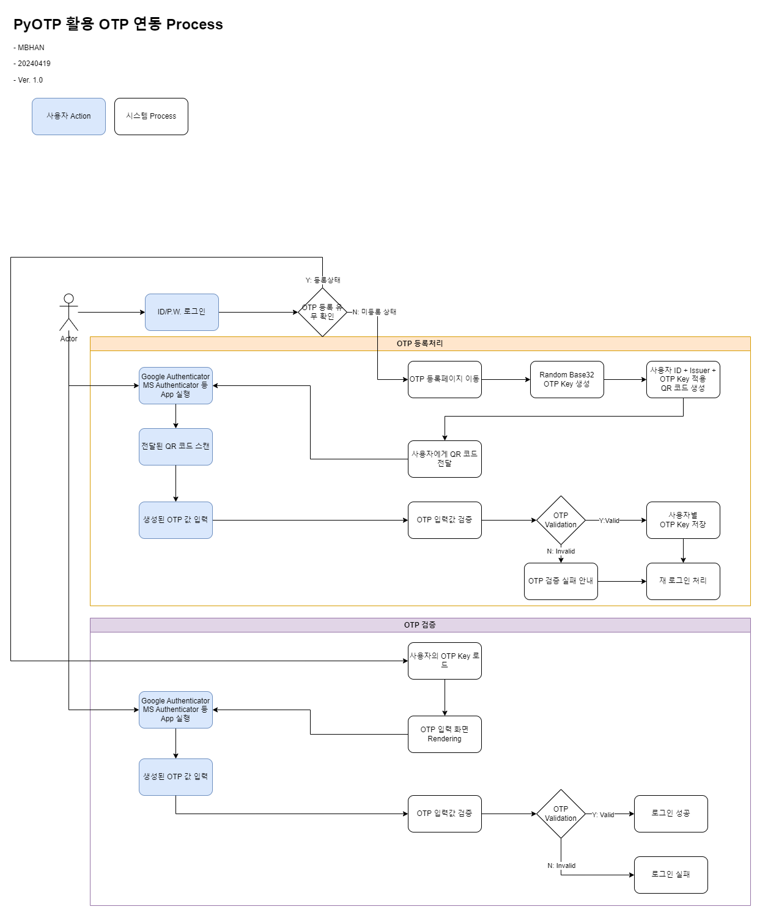
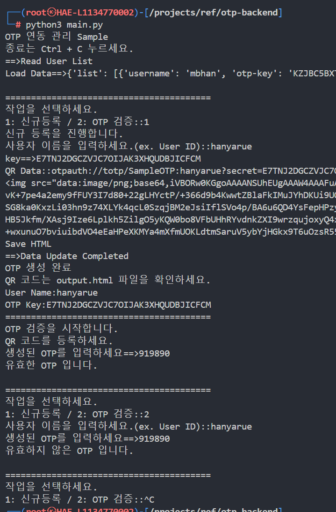

# PyOTP-Sample

PyOTP 라이브러리를 활용한 OTP 생성 및 QR 코드, OTP Key 관리 콘솔 Sample

## Process

## 실행화면

## 실행방법

1. `pip install -r requirements.txt` 실행하여 라이브러리 설치
2. `python3 main.py` 실행

## 활용
- 본 샘플의 내용을 바탕으로 API를 생성하여 OTP 등록 및 관리
- Base64 형태의 QR 코드 이미지 제공으로 폭넓게 적용 가능

20240418 MBHAN